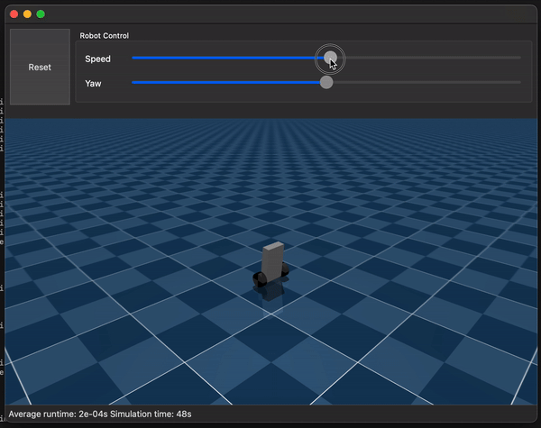

# Self balancing robot simulation in MuJoCo

## What / Why
Simulation of a two wheeled self balancing robot, this time using [MuJoCo](https://mujoco.org/). The robot uses a Linear–quadratic regulator (LQR) controller to maintain balance. In this example the MuJoCo simulation view is embedded in a Qt application (PySide6) to provide UI widgets for controlling the robot. 

After implementing the same simulation using PyBullet (see [here](https://github.com/lachlanhurst/balance-robot-pybullet-sim)), I found that PyBullet support for [Stable-Baselines3](https://stable-baselines3.readthedocs.io/) / [Gymnasium](https://gymnasium.farama.org/index.html) was a little lacking. It made sense to switch to MuJoCo given how early on this project is.

## Setting up the development environment

Clone the repo

    git clone https://github.com/lachlanhurst/balance-robot-mujoco-sim.git
    cd balance-robot-mujoco-sim

It's recommended to use the conda environment file included in this repository; these commands will create and activate a new `robot-mujoco-simulation` conda env.

    conda env create -f conda-environment.yaml
    activate robot-mujoco-simulation

## Calculating LQR parameters

The LQR parameters are already [included in the source code](./src/simulation/robot_lqr.py). There is no need to re-calculate these parameters unless the physical characteristics of the robot change (as defined in [`robot-02.xml`](./src/simulation/robot-02.xml)).

If you do need to re-calculate these parameters follow the process defined in the [PyBullet simulation repo](https://github.com/lachlanhurst/balance-robot-pybullet-sim).

## Running the simulation

The following command will run the simulation. Note: the `robot-mujoco-simulation` must be activated

    python src/simulation/simulate_robot.py

## Acknowledgements

[Jean Elsner](https://github.com/JeanElsner) put together this [great simple example](https://gist.github.com/JeanElsner/755d0feb49864ecadab4ef00fd49a22b) on how to embed a MuJoCo simulation within a PySide6 application.

